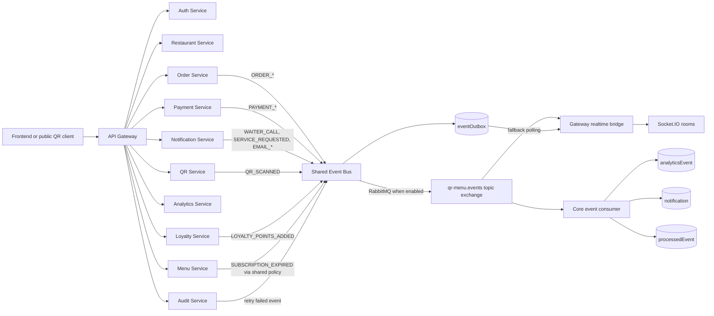

# Service Boundaries

This backend is split into three layers with intentionally different responsibilities.

## API gateway

The gateway owns ingress concerns only:

- public API prefix and route-to-service mapping
- public vs authenticated route policy
- JWT verification for protected ingress
- upstream load balancing and proxy path rewriting
- Socket.IO realtime fan-out from the event stream

The gateway must not own restaurant, menu, order, payment, loyalty, analytics, audit, or notification business rules.

## Domain services

Each service owns its HTTP routes, controllers, schemas, and domain service logic for one bounded context:

- `auth-service`: login, registration, reset flow, employees
- `restaurant-service`: restaurants, tables, subscriptions
- `menu-service`: categories, foods, modifiers, upload wiring
- `order-service`: order lifecycle, order inventory effects
- `payment-service`: payment lifecycle, Stripe/demo payment adapters
- `notification-service`: notifications, waiter calls, email dispatch
- `analytics-service`: reporting and analytics reads
- `qr-service`: QR generation and scan tracking
- `loyalty-service`: customer loyalty points
- `audit-service`: audit logs and event outbox administration

Service `app.js` files should only declare their owned routers and startup port. Common Express setup belongs in `shared/http/serviceApp.js`.

## Shared

Shared code is limited to cross-cutting infrastructure and stable contracts:

- config and database client wiring
- middleware used consistently by services
- constants and request schemas shared across contexts
- generic response, error, logging, tenant, token, cache, mail, storage, and event bus helpers

Shared code should not contain service-specific orchestration unless it is an explicit cross-cutting policy.

## Event Flow

When `RABBITMQ_URL` is empty, published events are still recorded in `eventOutbox`; the gateway realtime bridge uses outbox polling as its fallback.
